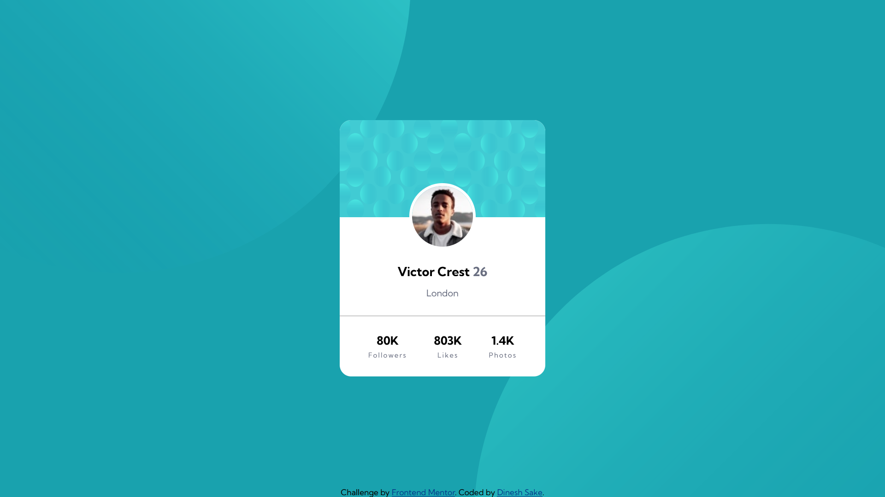

# Frontend Mentor - Profile card component solution

This is a solution to the [Profile card component challenge on Frontend Mentor](https://www.frontendmentor.io/challenges/profile-card-component-cfArpWshJ). Frontend Mentor challenges help you improve your coding skills by building realistic projects. 

## Table of contents

- [Overview](#overview)
  - [The challenge](#the-challenge)
  - [Screenshot](#screenshot)
  - [Links](#links)
- [My process](#my-process)
  - [Built with](#built-with)
  - [What I learned](#what-i-learned)
  - [Continued development](#continued-development)
- [Author](#author)


## Overview

### The challenge

- Build out the project to the designs provided

### Screenshot




### Links

- Solution URL: [My Repository](https://github.com/Nrupatungan/profile-card-component)
- Live Site URL: [My site](https://nrupatungan.github.io/profile-card-component/)

## My process

### Built with

- Semantic HTML5 markup
- CSS custom properties
- Flexbox
- Mobile-first workflow

### What I learned

I learned how to insert multiple background images and position them on the screen. It was all about trial and error, but I got my desired result at the end, that's all that matters.

```css
body{
    background-image: url(./images/bg-pattern-top.svg), url(./images/bg-pattern-bottom.svg);
    background-repeat: no-repeat, no-repeat;
    background-position: left -200vw bottom 45vh, right -200vw top 45vh;
    background-color: hsl(185, 75%, 39%);
}
```

If you want more help with writing markdown, we'd recommend checking out [The Markdown Guide](https://www.markdownguide.org/) to learn more.

### Continued development

I'd love to learn all the in's and out's of CSS Grid and use it in my future projects. I'm also looking towards learning Advanced HTML & CSS like embedding videos, tables, forms etc.

## Author

- Frontend Mentor - [@Dinesh_Sake](https://www.frontendmentor.io/profile/Nrupatungan)
- Github - [@Dinesh_Sake](https://github.com/Nrupatungan)
